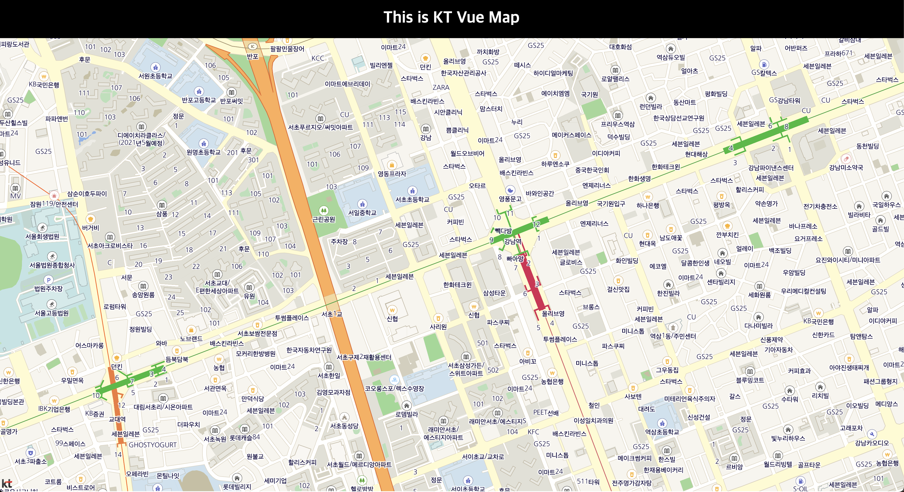

# Vue에서 KTMapSDK WebComponent 시작하기

<aside>
💡 튜토리얼의 목표      

**Vue 프로젝트를 생성하고 **KTMapSDK WebComponent**를 npm 으로 설치 후 web component 방식으로 개발하는 방법을 이 튜토리얼에서 설명합니다. 웹 컴포넌트를 사용하여 빠르게 개발할 수 있도록 설계되었습니다. Map을 화면에 띄우고, Control을 추가하고, Overlay 추가 후 Layer를 사용하는 과정을 설명합니다.**

</aside>

# Getting Start

### API key 발급

1. KT API 사이트 *[(https://apilink.kt.co.kr/)](https://apilink.kt.co.kr/)* 접속

2. 계정 가입 및 로그인

3. 권한신청 메뉴로 이동

4. API 신청 > 일반개발자 | 개인사업자 | 법인사업자 | GiGA Genie 제휴법인 중 해당 소속 선택

5. 정보입력 후 권한 신청

### Node.js and npm 준비

1. [https://nodejs.org/en](https://nodejs.org/en) 에 접속하여 node.js 설치합니다 
2. npm 및 node 버전 확인을 통해 설치가 잘 되었는지 확인합니다
    
    ```jsx
    //npm 버전 확인
    cmd > npm -v 
    
    //node 버전 확인
    cmd > node -v
    ```
    

# Create an App using Vue

vue CLI ( 기본적인 vue 개발환경 설정해주는 도구 )를 사용하여 Vue 앱을 생성하지 않고, `vite`를 통해 Vue 프로젝트 생성하는 과정을 보여드리겠습니다. 저희 본 튜토리얼은 `typescript`로 진행합니다. 

Vue 환경설정을 잘 아시는 분이면 [Create Navbar Component](https://www.notion.so/Vue-KTMapSDK-3f23b5da45a84b80865d4078818f7275?pvs=21) 챕터로 바로 넘어가셔도 됩니다.

### **Vite로 Vue 프로젝트 생성**

mac 기준 프롬프트 창에서 vite를 통해 vue 프로젝트 생성하는 과정을 보여드리겠습니다. 

1. cmd에 아래와 같이 vite로 Vue 프로젝트 생성하는 명령어를 입력합니다
    
    ```bash
    npm create vite@latest
    ```
    
2. 프로젝트 이름을 설정합니다
    
    
    
3. framework는 Vue를 선택합니다
    
    
    
4. 언어를 Typescript로 선택합니다
    
    
    
5. 아래와 같은 화면이 나오면 Vue 프로젝트가 생성된 것입니다.
    
    
    

### **디렉토리 이동 후 시작**

생성된 프로젝트로 디렉토리를 이동하고, 필요한 모듈을 설치하고, Vue 프로젝트를 start 하는 과정을 설명드리겠습니다. 

cmd에 아래 명령어 3개를 순서대로 입력합니다. 

```bash
cd ktmap-vue-tutorial //디렉토리 이동
npm install //필요한 모듈 설치
npm run dev //프로젝트 start
```

아래와 같이 Vue 초기 화면을 브라우저에서 확인하시면 환경셋팅에 성공하신겁니다


### 설치 및 설정

kt-map-sdk-webcomponent는 kt-map-sdk-js를 캡슐화하여 웹 컴포넌트로 제공하는 라이브러리입니다.

<aside>
💡 웹 컴포넌트란

웹 컴포넌트는 재사용 가능한 **사용자 정의 HTML 요소**에 HTML, CSS 및 JS를 캡슐화하는 널리 사용되는 W3C 표준입니다. 이러한 재사용 가능한 컴포넌트는 지도 표시와 같은 기능부터 보다 복잡한 비즈니스 로직까지 다양한 기능을 캡슐화합니다. 이 가이드에서는 kt map sdk 에서 사용할 수 있는 웹 컴포넌트를 설명합니다.

</aside>

kt-map-sdk-webcomponent 라이브러리는 npm 패키지([kt-map-sdk-js](https://www.npmjs.com/package/kt-map-sdk-js))를 통해 설치할 수 있습니다. kt-map-sdk-webcomponent 라이브러리를 설치하려면 라이브러리를 설치하려면 프로젝트 폴더로 이동하여 다음 명령을 실행하십시오. 

```bash
npm install kt-map-sdk-webcomponent
```

Vue 프로젝트의 레이아웃을 구성하겠습니다.
src 폴더로 이동하며 파일 App.vue 의 모든 내용을 삭제합니다. App.vue 다음 내용을 작성하세요.

> src/App.tsx
> 

```jsx
<template>
    <div class="app">
        This is KT Map App
				<!-- 네비바와 지도가 들어갈 영역입니다  -->
    </div>
</template>

<script>

export default {
    name: 'App'
};
</script>

<style>
.app {
    text-align: center;
}
</style>
```

style.css 파일을 삭제하세요.

> src/main.ts
> 

main.ts의 `import './style.css'` 한 줄을 삭제하세요.

```tsx
import { createApp } from 'vue'

import App from './App.vue'

createApp(App).mount('#app')
```

이제 브라우저([http://localhost:8080/](http://localhost:8080/))에  "This is KT Map App"가 표시됩니다.

 `src/components`폴더 로 이동하여 `HelloWorld.vue`파일을 삭제하세요.

### **Create a navbar component**

화면 상단에 navbar 컴포넌트를 만드는 과정은 아래와 같습니다.

Navbar 컴포넌트를 생성하여 컨텐츠를 구성합니다.

src/components 폴더로 이동하여 Navbar.vue 파일을 생성하세요. 
Navbar.vue 파일 내에 다음과 같이 작성하세요.

> src/components/Navbar.vue
> 

```tsx
<template>
    <div class="heading">
        <h1>This is KT Vue Map</h1>
    </div>
</template>

<script>
export default {
    name: 'Navbar',
};
</script>

<style>
body {
    margin: 0;
}
.heading {
    margin: 0;
    padding: 0px;
    background-color: black;
    color: white;
}

.heading > h1 {
    padding: 20px;
    margin: 0;
}
</style>

```

Navbar를 표시하기 위해서는

1. Navbar를 import 해야합니다.
2. App.vue의 main component template 안에 Navbar를 추가해야 합니다.

> src/App.tsx
> 

```tsx
<template>
    <div class="app">
        **<Navbar />**
    </div>
</template>

<script>
**import Navbar from './components/Navbar.vue';**
export default {
    name: 'App',
    **components: {
        Navbar,
    },**
};
</script>

<style>
.app {
    text-align: center;
}
</style>
```

아래와 같이 Navbar가 추가된 화면을 브라우저에서 확인할 수 있습니다.create a map component


### create a map component

이 단계에서는 간단한 지도 component를 만듭니다.

Navbar 아래에 전체 사이즈로 KT Map을 넣겠습니다.

KT Map에 관련된 모듈을 import를 통해 셋팅합니다.

 `components` 폴더 내부에 `Map.vue`라는 새 파일을 생성합니다.

Vue의 Map 컴포넌트를 정의합니다. 내부적으로 KT Map 라이브러리를 통해 Map을 구성합니다.

Map 컴포넌트에서 KT Map을 초기화하는 코드입니다.

```tsx
<script>
import {shallowRef, onMounted, onUnmounted} from 'vue';
import ktMapComponent from 'kt-map-sdk-webcomponent'

export default {
    name: 'Map',
    setup() {
        const mapIns = shallowRef(null); // ktMap 객체

     
        onMounted(()=>{
            mapIns.value = ktMapComponent.ktMapCatalog.getMap('map') ;
						// ktMap이 들어간 DOM을 바인딩 해줍니다.
        })

        onUnmounted(() => { 
            mapIns.value?.remove(); // 기존에 생성한 map이 있다면 생성하지 않습니다.
        });

        return {
            mapIns,
        };
    },
};
</script>
```

KT Map이 들어가야 될 html은 다음과 같습니다.

캡슐화된 웹컴포넌트인 커스텀 엘리먼트 <kt-map></kt-map>을 이용하여 빠르게 지도를 띄울 수 있습니다.

```tsx
<template>
    <div class="mapArea map" >
        <kt-map id="map" zoomValue="15" mapStyle="normal" bearingValue="0" pitchValue="0" lng="127.02836" lat="37.4964" >
       </kt-map>
    </div>
</template>
```

위의 내용을 종합적으로 완성된 코드는 아래와 같습니다.

> src/components/Map.vue
> 

```tsx
<template>
    <div class="mapArea map" >
        **<kt-map id="map" zoomValue="15" mapStyle="normal" bearingValue="0" pitchValue="0" lng="127.02836" lat="37.4964" >
	      </kt-map>**
    </div>
</template>

<script>
import {shallowRef, onMounted, onUnmounted} from 'vue';
import ktMapComponent from 'kt-map-sdk-webcomponent'

export default {
    name: 'Map',
    setup() {
        const mapIns = shallowRef(null); // ktMap 객체

        onMounted(()=>{
            mapIns.value = ktMapComponent.ktMapCatalog.getMap('map') ;
        })

        onUnmounted(() => { 
            mapIns.value?.remove(); // 기존에 생성한 map이 있다면 생성하지 않습니다.
        });

        return {
            mapIns,
        };
    },
};
</script>

<style>
.mapArea {
    position: relative;
    width: 100%;
    height: calc(100vh - 80px);
}
.mapArea map {
    position: absolute;
    width: 100%;
    height: 100%;
}
</style>
```

### **Render a map**

생성한 Map 컴포넌트를 App.tsx에 추가합니다. 

> src/App.vue
> 

```tsx
<template>
    <div class="app">
        <Navbar />
        **<Map />**
    </div>
</template>

<script>
import Navbar from './components/Navbar';
**import Map from './components/Map';**

export default {
    name: 'App',
    components: {
        Navbar,
        **Map,**
    },
};
</script>

<style>
.app {
    text-align: center;
}
</style>
```

Navbar와 KT Map이 렌더링 된 화면은 아래와 같습니다.



### Map Options

map 생성 시 map을 설정하기 위한 option들이 있습니다. 

- `style` : 지도의 스타일입니다. 기본지도, 위성지도, 하이브리드지도 등을 설정할 수 있습니다.
- `center` : 지도의 초기 중심 위치입니다.
- `zoom` : 지도의 초기 확대/축소 수준입니다.
- `bearing` : 지도의 초기 회전 각도입니다.
- `pitch` : 지도의 초기 pitch(기울기)입니다.

이 option 외에도 다른 option들이 많으며, 더 자세한 것은 Map 및 Map Options API DOCS를 확인해주세요

→ [Map API DOCS](https://map.gis.kt.com/mapsdk/web/apidoc/types/MapOptions.MapOptions.html)

→ [MapOptions API DOCS](https://map.gis.kt.com/mapsdk/web/apidoc/types/MapOptions.MapOptions.html)

### Map Event

<kt-map>의 click 프로퍼티를 통해 지도에 이벤트를 추가할 수 있습니다. 지도를 클릭하면 클릭한 좌표의 위경도 좌표를 console로 출력되도록 이벤트를 추가하겠습니다.

KTMapSDK WebComponent를 활용하여 지도에 이벤트를 추가하기 위해선 총 3가지 단계를 거쳐야합니다.

1. 함수 선언하기

지도를 클릭하면 클릭한 좌표의 위경도 좌표를 console로 출력하도록 함수를 선언하겠습니다.

```jsx
// 클릭하면 위경도 좌표를 콘솔에 출력하는 함수입니다.
const mapClick = (event) => { 
	console.log(`lng:${event.lngLat.lng}, lat:${event.lngLat.lat}`)
}
```

1. ktMapCatalog에 이벤트 등록하기

```jsx
// 'eventId'라는 Id로 mapClick 함수 등록
ktMapComponent.ktMapCatalog.addEvent('mapClick', mapClick)
```

1. `<kt-map>` 웹 컴포넌트에 eventId를 property로 전달해주기

```html
<kt-map id="map" zoomValue="15" mapStyle="normal" bearingValue="0" pitchValue="0"
		 lng="127.02836" lat="37.4964" **click="mapClick"** >
</kt-map>
```

Map Event까지 추가한 코드는 아래와 같습니다. 

> src/components/Map.vue
> 

```jsx
<template>
    <div class="mapArea map" >
        <kt-map id="map" zoomValue="15" mapStyle="normal" bearingValue="0" pitchValue="0"
							 lng="127.02836" lat="37.4964" **click="mapClick"** >
       </kt-map>
    </div>
</template>

<script>
import {shallowRef, onMounted, onUnmounted} from 'vue';
import ktMapComponent from 'kt-map-sdk-webcomponent'

export default {
    name: 'Map',
    setup() {
        const mapIns = shallowRef(null); // ktMap 객체
        **const mapClick = (event) => { // 클릭하면 위경도 좌표를 콘솔에 출력하는 함수입니다.
            console.log(`lng:${event.lngLat.lng}, lat:${event.lngLat.lat}`)
        }**
        
        onMounted(()=>{
            mapIns.value = ktMapComponent.ktMapCatalog.getMap('map') ;
            // ktMap이 들어간 DOM을 바인딩 해줍니다.

            **ktMapComponent.ktMapCatalog.addEvent('mapClick', mapClick)**
            // 'eventId'라는 Id로 mapClick 함수 등록
        })

        onUnmounted(() => { 
            mapIns.value?.remove(); // 기존에 생성한 map이 있다면 생성하지 않습니다.
        });
      
        return {
            mapIns,
        };
    },
};
</script>

<style>
.mapArea {
    position: relative;
    width: 100%;
    height: calc(100vh - 80px);
}
.mapArea map {
    position: absolute;
    width: 100%;
    height: 100%;
}
</style>
```

# Add Control

Control 이란 지도 영역의 모서리 중 하나에서 발생하는 모든 종류의 버튼과 정보 표시에 일반적으로 사용됩니다. 

지도에 추가할 수 있는 사용자 인터페이스 요소입니다.

NavigationControl을 지도에 추가하는 코드는 아래와 같습니다.

Control을 지도에 추가하기 위해선 아래와 같이 <kt-map> 웹 컴포넌트 태그 내부에 컨트롤 컴포넌트 태그를 추가해줍니다.

> src/components/Map.vue
> 

```tsx
<template>
    <div class="mapArea map" >
        <kt-map id="map" zoomValue="15" mapStyle="normal" bearingValue="0" pitchValue="0" lng="127.02836" lat="37.4964" click="mapClick" >
            **<kt-navigation-control position="top-right"></kt-navigation-control>**
       </kt-map>
    </div>
</template>
```

NavigationControl 이 추가된 결과입니다.


### 각 종류별 control 설명 및 추가

- Navigation Control : 지도의 zoom, bearing, pitch를 조정할 수 있는 컨트롤입니다.
- Minimap Control : 현재 지도의 미니어처 오버뷰를 표시하는 컨트롤입니다.
- Draw Control : 지도 위에서 도형을 그리고 측정할 수 있는 컨트롤입니다.
- Scale Control : 지도 축척(지면의 해당 거리에 대한 지도의 거리 비율)을 표시하는 컨트롤입니다.

위의 4개의 컨트롤러를 추가하겠습니다.

```tsx
<template>
    <div class="mapArea map" >
        <kt-map id="map" zoomValue="15" mapStyle="normal" bearingValue="0" pitchValue="0" lng="127.02836" lat="37.4964" click="mapClick" >
            **<kt-navigation-control position="top-right"></kt-navigation-control>
            <kt-minimap-control position="bottom-right"></kt-minimap-control>
            <kt-draw-control position="top-left"></kt-draw-control>
            <kt-scale-control position="bottom-left"></kt-scale-control>**
       </kt-map>
    </div>
</template>
```

Navbar와 KT Map과 4개의 컨트롤러들이 추가된 화면은 아래와 같습니다. 


왼쪽 상단에 Draw Control, 왼쪽 하단에 Scale Control, 오른쪽 상단에 Navigation Control, 오른쪽 하단에 Minimap Control이 추가된 것을 확인할 수 있습니다.

4개의 컨트롤 이외에도 다른 컨트롤들이 있으며, 더 자세한 사항은 API DOCS를 확인해주세요

→ [Control API DOCS](https://map.gis.kt.com/mapsdk/web/apidoc/classes/Map.Map.html#addControl)

## **Add Overlay**

****Add Marker****

Marker는 지도 상에 특정 위치에 원하는 아이콘 또는 이미지를 표출하는 기능입니다.

Marker를 생성하는 코드는 아래와 같습니다.

```tsx
<kt-marker id="defaultMarkerId" lng="127.0293561" lat="37.4713529" color="#FF0000"></kt-marker>
```

마커가 추가된 결과는 아래와 같습니다.


디폴트 마커 대신 이미지를 표출하기 위해선 `<kt-marker>` 태그 사이에 표출하고 싶은 `` 태그를 넣으면 됩니다.

```tsx
<kt-marker id="imgMarkerId" lng="127.047414" lat="37.475401" offset="[0,0]" label="위스키" labelOffset="[0,12]" labelColor="#0000ff" labelSize="16">
		
</kt-marker>
```

이미지 마커가 추가된 결과는 아래와 같습니다.


마커에 대한 더 자세한 사항은 API DOCS를 확인해주세요

→ [Marker API DOCS](https://map.gis.kt.com/mapsdk/web/apidoc/classes/overlay_Marker.Marker.html)

현재까지의 코드는 아래와 같습니다.

> src/components/Map.vue
> 

```tsx
<template>
    <div class="mapArea map" >
        <kt-map id="map" zoomValue="16" mapStyle="normal" bearingValue="0" pitchValue="0" lng="127.0293561" lat="37.4713529" click="mapClick" >
            <kt-navigation-control position="top-right"></kt-navigation-control>
            <kt-minimap-control position="bottom-right"></kt-minimap-control>
            <kt-draw-control position="top-left"></kt-draw-control>
            <kt-scale-control position="bottom-left"></kt-scale-control>
            <kt-marker id="defaultMarkerId" lng="127.0293561" lat="37.4713529" color="#FF0000"></kt-marker>
            <kt-marker id="imgMarkerId" lng="127.047414" lat="37.475401" offset="[0,0]" label="위스키" labelOffset="[0,12]" labelColor="#0000ff" labelSize="16">
                
            </kt-marker>
       </kt-map>
    </div>
</template>

<script>
import {shallowRef, onMounted, onUnmounted} from 'vue';
import ktMapComponent from 'kt-map-sdk-webcomponent'

export default {
    name: 'Map',
    setup() {
        const mapIns = shallowRef(null); // ktMap 객체
        const mapClick = (event) => { // 클릭하면 위경도 좌표를 콘솔에 출력하는 함수입니다.
            console.log(`lng:${event.lngLat.lng}, lat:${event.lngLat.lat}`)
        }
        
        onMounted(()=>{
            mapIns.value = ktMapComponent.ktMapCatalog.getMap('map') ;
            // ktMap이 들어간 DOM을 바인딩 해줍니다.

            ktMapComponent.ktMapCatalog.addEvent('mapClick', mapClick)
            // 'eventId'라는 Id로 mapClick 함수 등록
        })

        onUnmounted(() => { 
            mapIns.value?.remove(); // 기존에 생성한 map이 있다면 생성하지 않습니다.
        });
      
        return {
            mapIns,
        };
    },
};
</script>

<style>
.mapArea {
    position: relative;
    width: 100%;
    height: calc(100vh - 80px);
}
.mapArea map {
    position: absolute;
    width: 100%;
    height: 100%;
}
</style>
```

### Add InfoWindow

InfoWindow는 지도 위의 특정 지점에 대한 상세정보를 제공하기 위한 기능입니다.

InfoWindow는 말풍선과 같은 형태를 가지며 정보를 기술하는 영역과 지도상의 특정 지점과 연결되는 말풍선 anchor로 구성됩니다.

일반적으로 인포윈도우는 지도상의 특정지점(POI)상에 직접 출력되거나 마커 상단에 출력되는 형태를 가집니다.

InfoWindow를 생성하는 코드는 아래와 같습니다. 

```html
<kt-infowindow lng="127.029414" lat="37.471401">
  <h1>InfoWindow</h1>
</kt-infowindow>
```

Map 컴포넌트에 InfoWindow를 추가하겠습니다.

12~14라인에서 InfoWindow 추가 코드를 볼 수 있습니다.

```tsx
<template>
    <div class="mapArea map" >
        <kt-map id="map" zoomValue="16" mapStyle="normal" bearingValue="0" pitchValue="0" lng="127.0293561" lat="37.4713529" click="mapClick" >
            <kt-navigation-control position="top-right"></kt-navigation-control>
            <kt-minimap-control position="bottom-right"></kt-minimap-control>
            <kt-draw-control position="top-left"></kt-draw-control>
            <kt-scale-control position="bottom-left"></kt-scale-control>
            <kt-marker id="defaultMarkerId" lng="127.0293561" lat="37.4713529" color="#FF0000"></kt-marker>
            <kt-marker id="imgMarkerId" lng="127.047414" lat="37.475401" offset="[0,0]" label="위스키" labelOffset="[0,12]" labelColor="#0000ff" labelSize="16">
                
            </kt-marker>
            **<kt-infowindow lng="127.0293561" lat="37.4813529">
                <h2>Hello World</h2>
            </kt-infowindow>**
        <kt-geojson-source id="geoJsonSource" dataUrl="https://map.gis.kt.com/mapsdk/data/seoul_sub.geojson"></kt-geojson-source>
      <kt-geojson-source id="geoJsonSource" dataUrl="https://map.gis.kt.com/mapsdk/data/seoul_sub.geojson"></kt-geojson-source>
      <kt-polygon-layer id="polygonLayer" source="geoJsonSource" 
        paint="fill-antialias:true; fill-color:#0000ff; fill-outline-color:#ff0000; fill-opacity:0.1"
        layout="visibility:visible">
      </kt-polygon-layer>
       </kt-map>
    </div>
</template>

```

인포윈도우가 추가된 화면은 아래와 같습니다.


### Custom InfoWindow

인포윈도우에 원하는 데이터를 포함하여 표출하기 위해선 태그 인포윈도우 컴포넌트에 데이터 프로퍼티를 넘겨주고 `<kt-infowindow>` 태그 사이에서 `{#key}` 방식으로 접근할 수 있습니다.

Custom InfoWindow를 생성하여 지도에 추가하는 코드는 아래와 같습니다. 

```html
<kt-infowindow lng="127.029414" lat="37.471401" closeOnClick="false"
	data='{"title":"KT연구개발센터","category":"산업/기간시설","url":"https://map.gis.kt.com/index.html?v=1693543266115","addr":"서울특별시 서초구 태봉로 151","tel":"02-526-5114"}'>
	<div style="padding: 10px 10px 15px; width:180px;">
		<div style="display: inline-block;vertical-align: top;">
			<strong style="margin-right: 6px;font-size: 16px;font-weight: 700;letter-spacing: -1px;color: #0068c3;line-height: 23px;">#{title}</strong>
			<span style="font-size: 13px;line-height: 19px;color: #8f8f8f;">#{category}</span>
    </div>
		<div style="margin-top: 5px;">
			<span style="font-size: 14px;line-height: 22px;color: #424242;">#{addr}</span>
		</div>
	</div>
</kt-infowindow>
```

Map 컴포넌트에 기존의 InfoWindow는 삭제하고 Custom InfoWindow를 추가하겠습니다.

12~23라인에서 Custom InfoWindow 추가 코드를 볼 수 있습니다.

```html
<template>
    <div class="mapArea map" >
        <kt-map id="map" zoomValue="16" mapStyle="normal" bearingValue="0" pitchValue="0" lng="127.0293561" lat="37.4713529" click="mapClick" >
            <kt-navigation-control position="top-right"></kt-navigation-control>
            <kt-minimap-control position="bottom-right"></kt-minimap-control>
            <kt-draw-control position="top-left"></kt-draw-control>
            <kt-scale-control position="bottom-left"></kt-scale-control>
            <kt-marker id="defaultMarkerId" lng="127.0293561" lat="37.4713529" color="#FF0000"></kt-marker>
            <kt-marker id="imgMarkerId" lng="127.047414" lat="37.475401" offset="[0,0]" label="위스키" labelOffset="[0,12]" labelColor="#0000ff" labelSize="16">
                
            </kt-marker>
            **<kt-infowindow lng="127.029414" lat="37.471401" closeOnClick="false"
                data='{"title":"KT연구개발센터","category":"산업/기간시설","url":"https://map.gis.kt.com/index.html?v=1693543266115","addr":"서울특별시 서초구 태봉로 151","tel":"02-526-5114"}'>
                <div style="padding: 10px 10px 15px; width:180px;">
                <div style="display: inline-block;vertical-align: top;">
                    <strong style="margin-right: 6px;font-size: 16px;font-weight: 700;letter-spacing: -1px;color: #0068c3;line-height: 23px;">#{title}</strong>
                    <span style="font-size: 13px;line-height: 19px;color: #8f8f8f;">#{category}</span>
                </div>
                <div style="margin-top: 5px;">
                    <span style="font-size: 14px;line-height: 22px;color: #424242;">#{addr}</span>
                </div>
                </div>
            </kt-infowindow>** 
        <kt-geojson-source id="geoJsonSource" dataUrl="https://map.gis.kt.com/mapsdk/data/seoul_sub.geojson"></kt-geojson-source>
      <kt-geojson-source id="geoJsonSource" dataUrl="https://map.gis.kt.com/mapsdk/data/seoul_sub.geojson"></kt-geojson-source>
      <kt-polygon-layer id="polygonLayer" source="geoJsonSource" 
        paint="fill-antialias:true; fill-color:#0000ff; fill-outline-color:#ff0000; fill-opacity:0.1"
        layout="visibility:visible">
      </kt-polygon-layer>
       </kt-map>
    </div>
</template>
```

커스텀한 인포윈도우가 추가된 화면은 아래와 같습니다.


인포윈도우에 대한 더 자세한 사항은 API DOCS를 확인해주세요

→ [InfoWindow API DOCS](https://map.gis.kt.com/mapsdk/web/apidoc/classes/overlay_InfoWindow.InfoWindow.html)

# Add Layer

Layer는 Geography 데이터를 지도 상에 시각적으로 표현하는 기능입니다. 

Layer는 Source와 Style 요소로 정의됩니다. 

Polygon Layer를 예시로 설명 드리겠습니다. Polygon Layer는 데이터인 GeoJSON Source와 시각적 요소인 Fill Style로 구성됩니다. 그리고 GeoJSON Source는 Polygon 형태의 Geometry로 구성되어 있습니다. 


### Source, Style, Layer

**Source**

Source는 지도에 표출되어야하는 데이터를 나타냅니다. 소스에는 스타일 세부정보가 포함되어 있지 않기 때문에 소스를 추가하는 것으로는 맵에 데이터를 표시하기 충분하지 않습니다. 

따라서 레이어가 소스를 참고하여 시각적 표현을 제공합니다.

KTMapSDK WebComponent 에서는 `GeoJSONSource` 타입, `VectorSource`타입을 지원합니다. 그리고 `dataUrl` 프로퍼티를 통해 source data를 불러옵니다.

GeoJSON Source의 데이터를 바인딩하는 코드는 아래와 같습니다.

```html
<kt-geojson-source id="geoJsonSource" dataUrl="https://map.gis.kt.com/mapsdk/data/seoul_sub.geojson"></kt-geojson-source>
```

→ [Source API DOCS](https://map.gis.kt.com/mapsdk/web/apidoc/classes/source_GeoJSONSource.GeoJSONSource.html)

**Style**

Layer 설정 시 시각적인 요소들은 Style 객체로 정의합니다. 

KTMapSDK WebComponent 에서는 Paint 요소와 Layout 요소를 Layer의 프로퍼티로 전달해서 Layer에 style을 적용합니다.

폴리곤 레이어에 Fill Style을 적용하는 코드는 아래와 같습니다.

```jsx
<kt-polygon-layer id="polygonLayer" source="geoJsonSource" 
  paint="fill-antialias:true; fill-color:#a374db; fill-outline-color:#ff0000; fill-opacity:0.35"
  layout="visibility:visible">
</kt-polygon-layer>
```

→ [Style API DOCS](https://map.gis.kt.com/mapsdk/web/apidoc/classes/style_FillStyle.FillStyle.html)

**Layer**

KTMapSDK WebComponent에서 Layer에 Source를 적용하는 두가지 방법에 대해 소개해드리겠습니다.

1. 맵에 GeoJSONSource를 추가하고, 해당 SourceId를 Layer 프로퍼티로 넘겨주는 경우
    
    (해당 경우에는 dataUrl을 통해서만 source의 geometry 정보를 넘겨줄 수 있습니다.)
    

```html
<kt-geojson-source id="geoJsonSource" dataUrl="https://map.gis.kt.com/mapsdk/data/seoul_sub.geojson"></kt-geojson-source>
<kt-polygon-layer id="polygonLayer" source="geoJsonSource" 
  paint="fill-antialias:true; fill-color:#0000ff; fill-outline-color:#ff0000; fill-opacity:0.1"
  layout="visibility:visible">
</kt-polygon-layer>
```

1. Layer 컴포넌트에 data 프로퍼티로 geometry 정보를 넘겨주는 경우
    
    (sourceProperty로 geometry의 속성을 넘겨줄 수도 있습니다. dataProperty 활용 예시는 [Layer Event](https://www.notion.so/Vanilla-KTMapSDK-WebComponent-7b50dce81c324408af7fd46ee4cc6073?pvs=21)에서 확인하실 수 있습니다.)
    

```html
<kt-polygon-layer id="polygonLayer2" source='[[[127.044414, 37.479701], [127.044414, 37.469701], [127.035514, 37.469701], [127.044414, 37.479701]]]'
	sourceProperty='{ "id": "06740", "area": "서울시 서초구", "description": "핫플레이스 상권" }'
	paint="fill-antialias:true; fill-color:#FF0000; fill-outline-color:#ff0000; fill-opacity:0.35"
	layout="visibility:visible">
</kt-polygon-layer>
```

Layer 추가까지 한 코드는 아래와 같습니다.

24~33라인에서 Layer 추가 코드를 볼 수 있습니다.

```tsx
<template>
    <div class="mapArea map" >
        <kt-map id="map" zoomValue="16" mapStyle="normal" bearingValue="0" pitchValue="0" lng="127.0293561" lat="37.4713529" click="mapClick" >
            <kt-navigation-control position="top-right"></kt-navigation-control>
            <kt-minimap-control position="bottom-right"></kt-minimap-control>
            <kt-draw-control position="top-left"></kt-draw-control>
            <kt-scale-control position="bottom-left"></kt-scale-control>
            <kt-marker id="defaultMarkerId" lng="127.0293561" lat="37.4713529" color="#FF0000"></kt-marker>
            <kt-marker id="imgMarkerId" lng="127.047414" lat="37.475401" offset="[0,0]" label="위스키" labelOffset="[0,12]" labelColor="#0000ff" labelSize="16">
                
            </kt-marker>
            <kt-infowindow lng="127.029414" lat="37.471401" closeOnClick="false"
                data='{"title":"KT연구개발센터","category":"산업/기간시설","url":"https://map.gis.kt.com/index.html?v=1693543266115","addr":"서울특별시 서초구 태봉로 151","tel":"02-526-5114"}'>
                <div style="padding: 10px 10px 15px; width:180px;">
                <div style="display: inline-block;vertical-align: top;">
                    <strong style="margin-right: 6px;font-size: 16px;font-weight: 700;letter-spacing: -1px;color: #0068c3;line-height: 23px;">#{title}</strong>
                    <span style="font-size: 13px;line-height: 19px;color: #8f8f8f;">#{category}</span>
                </div>
                <div style="margin-top: 5px;">
                    <span style="font-size: 14px;line-height: 22px;color: #424242;">#{addr}</span>
                </div>
                </div>
            </kt-infowindow> 
            <kt-geojson-source id="geoJsonSource" dataUrl="https://map.gis.kt.com/mapsdk/data/seoul_sub.geojson"></kt-geojson-source>
            **<kt-polygon-layer id="polygonLayer" source="geoJsonSource" 
                paint="fill-antialias:true; fill-color:#0000ff; fill-outline-color:#ff0000; fill-opacity:0.1"
                layout="visibility:visible">
            </kt-polygon-layer>
             <kt-polygon-layer id="polygonLayer2" source='[[[127.044414, 37.479701], [127.044414, 37.469701], [127.035514, 37.469701], [127.044414, 37.479701]]]'
			        sourceProperty='{ "id": "06740", "area": "서울시 서초구", "description": "핫플레이스 상권" }'
			        paint="fill-antialias:true; fill-color:#FF0000; fill-outline-color:#ff0000; fill-opacity:0.35"
			        layout="visibility:visible" click="layerEvent">
			      </kt-polygon-layer>**
       </kt-map>
    </div>
</template>
```

두개의 레이어를 추가한 결과입니다.


### Layer Event

KTMapSDK WebComponent에서 레이어에 이벤트를 추가하는 방식은 맵에 이벤트를 추가하는 방식과 동일합니다. 

1. 함수 선언하기

폴리곤 레이어를 클릭하면 Source 내 Property로 등록해뒀던 description이 alert로 출력되도록 이벤트를 추가하겠습니다.

```jsx
const layerClick = (event) => { // 클릭하면 레이어 Source내의 'description' property 값을 콘솔에 출력하는 함수입니다.
	console.log(`description : ${event.features[0].properties["description"]}`)
}
```

1. ktMapCatalog에 이벤트 등록하기

```jsx
// 'layerEvent'라는 Id로 layerClick 함수 등록
ktMapComponent.ktMapCatalog.addEvent('layerEvent', layerClick);
```

1. `<kt-polygon-layer>` 컴포넌트에 eventId를 property로 전달해주기

```html
<kt-polygon-layer id="polygonLayer2" source='[[[127.044414, 37.479701], [127.044414, 37.469701], [127.035514, 37.469701], [127.044414, 37.479701]]]'
  sourceProperty='{ "id": "06740", "area": "서울시 서초구", "description": "핫플레이스 상권" }'
  paint="fill-antialias:true; fill-color:#FF0000; fill-outline-color:#ff0000; fill-opacity:0.35"
  layout="visibility:visible" click="layerEvent">
</kt-polygon-layer>
```

Layer Event 까지 추가한 완성 코드는 아래와 같습니다. 

> src/components/Map.vue
> 

```tsx
<template>
    <div class="mapArea map" >
        <kt-map id="map" zoomValue="16" mapStyle="normal" bearingValue="0" pitchValue="0" lng="127.0293561" lat="37.4713529" click="mapClick" >
            <kt-navigation-control position="top-right"></kt-navigation-control>
            <kt-minimap-control position="bottom-right"></kt-minimap-control>
            <kt-draw-control position="top-left"></kt-draw-control>
            <kt-scale-control position="bottom-left"></kt-scale-control>
            <kt-marker id="defaultMarkerId" lng="127.0293561" lat="37.4713529" color="#FF0000"></kt-marker>
            <kt-marker id="imgMarkerId" lng="127.047414" lat="37.475401" offset="[0,0]" label="위스키" labelOffset="[0,12]" labelColor="#0000ff" labelSize="16">
                
            </kt-marker>
            <kt-infowindow lng="127.029414" lat="37.471401" closeOnClick="false"
                data='{"title":"KT연구개발센터","category":"산업/기간시설","url":"https://map.gis.kt.com/index.html?v=1693543266115","addr":"서울특별시 서초구 태봉로 151","tel":"02-526-5114"}'>
                <div style="padding: 10px 10px 15px; width:180px;">
                <div style="display: inline-block;vertical-align: top;">
                    <strong style="margin-right: 6px;font-size: 16px;font-weight: 700;letter-spacing: -1px;color: #0068c3;line-height: 23px;">#{title}</strong>
                    <span style="font-size: 13px;line-height: 19px;color: #8f8f8f;">#{category}</span>
                </div>
                <div style="margin-top: 5px;">
                    <span style="font-size: 14px;line-height: 22px;color: #424242;">#{addr}</span>
                </div>
                </div>
            </kt-infowindow> 
            <kt-geojson-source id="geoJsonSource" dataUrl="https://map.gis.kt.com/mapsdk/data/seoul_sub.geojson"></kt-geojson-source>
            <kt-polygon-layer id="polygonLayer" source="geoJsonSource" 
                paint="fill-antialias:true; fill-color:#0000ff; fill-outline-color:#ff0000; fill-opacity:0.1"
                layout="visibility:visible">
            </kt-polygon-layer>
             <kt-polygon-layer id="polygonLayer2" source='[[[127.044414, 37.479701], [127.044414, 37.469701], [127.035514, 37.469701], [127.044414, 37.479701]]]'
                sourceProperty='{ "id": "06740", "area": "서울시 서초구", "description": "핫플레이스 상권" }'
                paint="fill-antialias:true; fill-color:#FF0000; fill-outline-color:#ff0000; fill-opacity:0.35"
                layout="visibility:visible" click="layerEvent">
            </kt-polygon-layer>
       </kt-map>
    </div>
</template>

<script>
import {shallowRef, onMounted, onUnmounted} from 'vue';
import ktMapComponent from 'kt-map-sdk-webcomponent'

export default {
    name: 'Map',
    setup() {
        const mapIns = shallowRef(null); // ktMap 객체
        const mapClick = (event) => { // 클릭하면 위경도 좌표를 콘솔에 출력하는 함수입니다.
            console.log(`lng:${event.lngLat.lng}, lat:${event.lngLat.lat}`)
        }
        
        const layerClick = (event) => { // 클릭하면 레이어 Source내의 'description' property 값을 콘솔에 출력하는 함수입니다.
            console.log(`description : ${event.features[0].properties["description"]}`)
        }

        onMounted(()=>{
            mapIns.value = ktMapComponent.ktMapCatalog.getMap('map') ;
            // ktMap이 들어간 DOM을 바인딩 해줍니다.

            ktMapComponent.ktMapCatalog.addEvent('mapClick', mapClick)
            // 'eventId'라는 Id로 mapClick 함수 등록

            ktMapComponent.ktMapCatalog.addEvent('layerEvent', layerClick);
            // 'layerEvent'라는 Id로 layerClick 함수 등록
        })

        onUnmounted(() => { 
            mapIns.value?.remove(); // 기존에 생성한 map이 있다면 생성하지 않습니다.
        });
      
        return {
            mapIns,
        };
    },
};
</script>

<style>
.mapArea {
    position: relative;
    width: 100%;
    height: calc(100vh - 80px);
}
.mapArea map {
    position: absolute;
    width: 100%;
    height: 100%;
}
</style>
```

Layer가 추가된 최종화면은 아래와 같습니다.


레이어에 대한 더 자세한 사항은 API Document를 확인해주세요.

→ [Layer API DOCS](https://map.gis.kt.com/mapsdk/web/apidoc/classes/overlay_InfoWindow.InfoWindow.html)

이상으로 Vue 에서 Web Component를 사용해서 kt map을 사용하는 튜토리얼을 끝내겠습니다.